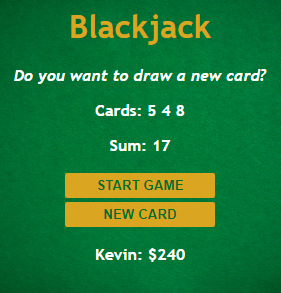

# freeCodeCamp - JavaScript Programming (Full Course)

Vidéo (parti 2) [freeCodeCamp](https://youtu.be/jS4aFq5-91M) utilisé pour réaliser cet exercice (BlackJackGame)

## Fonctionnalités

- Générer deux cartes avec des chiffres aléatoire
- Possibilité d'ajouter une carte si on souhaite ce rapprocher de 21 (pour avoir le blackjack et avoir plus de chance de gagner la main)
- Fonction permettant de stopper le jeu en cas de win (21) / loose (+21)
- Fonction permettant d'ajouter $100 a la victoire (21) / Retirer $50 à la défaite (+21)

## Rendu

- Page au démarrage 
- Lancement d'une partie 
- Ajout d'une nouvelle carte pour tenter le blackjack (21) 
- Ajouts des nouvelles cartes nécessaire pour savoir si on gagne ou non (pour cet exemple j'ai perdu car je suis au dessus de 21) 
